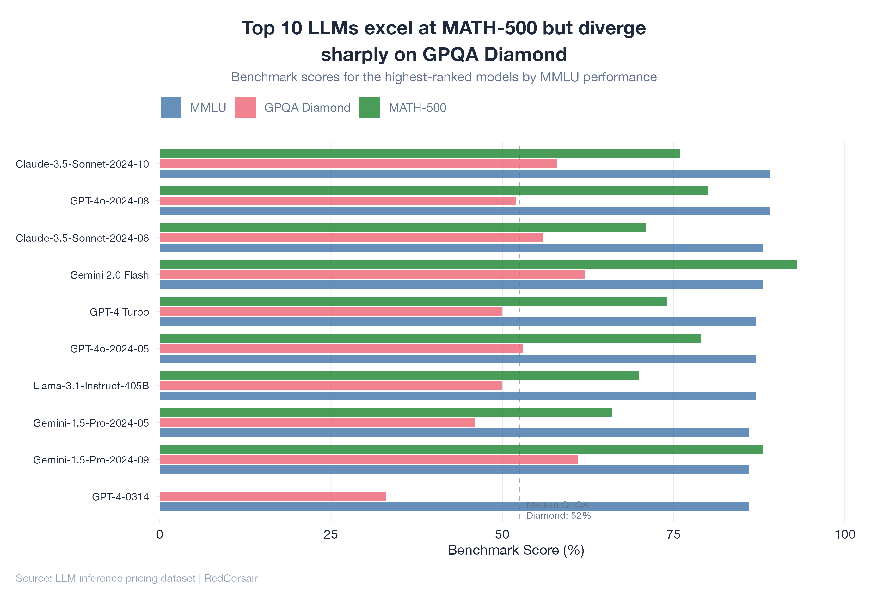
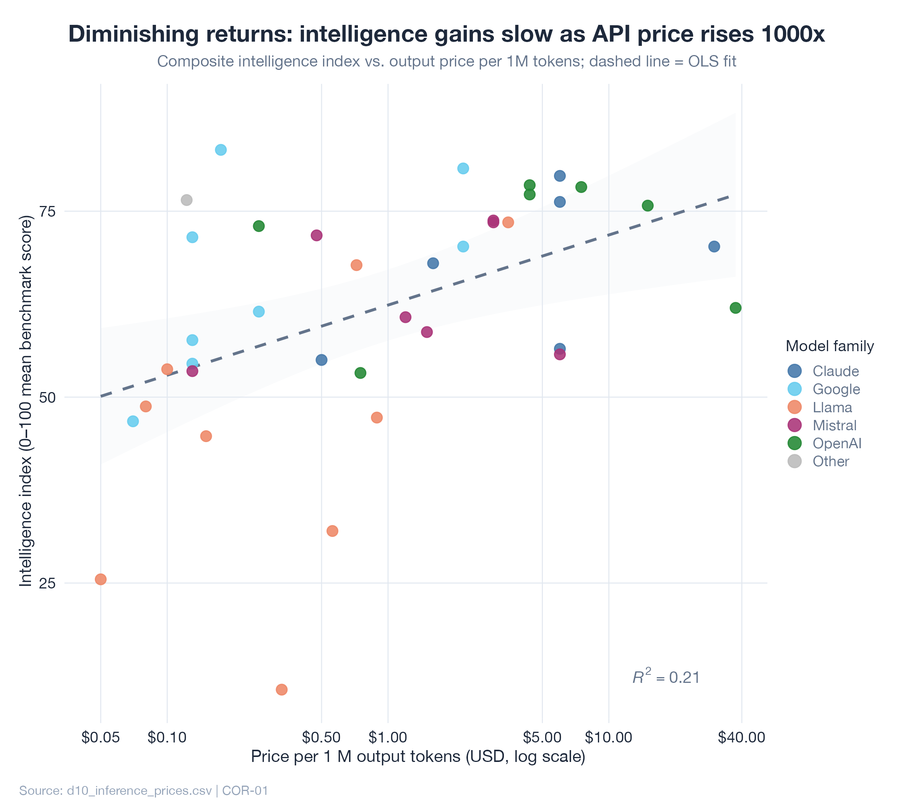
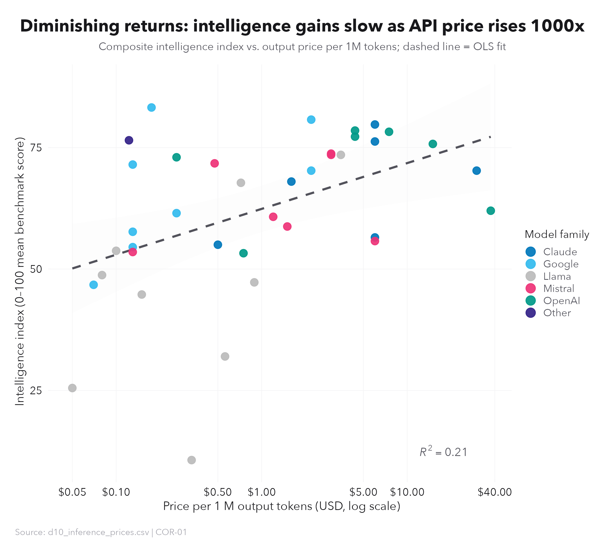
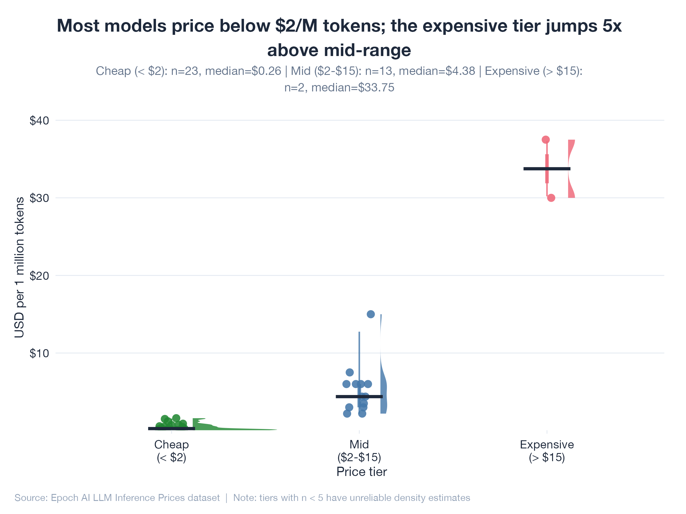
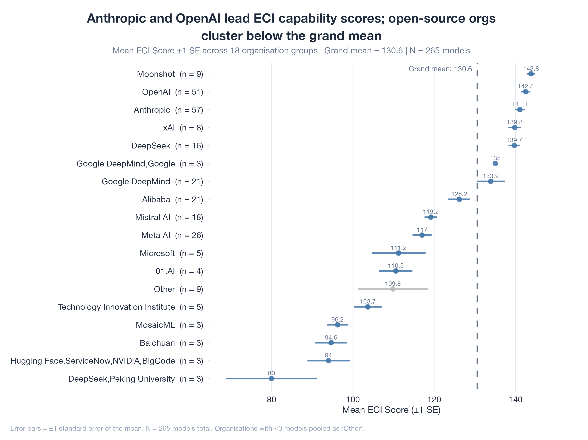
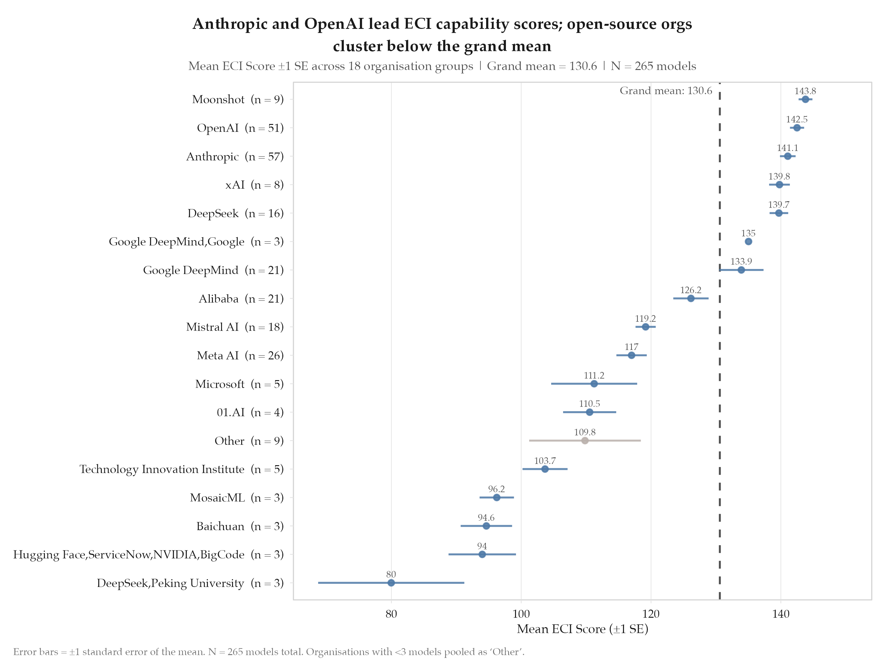
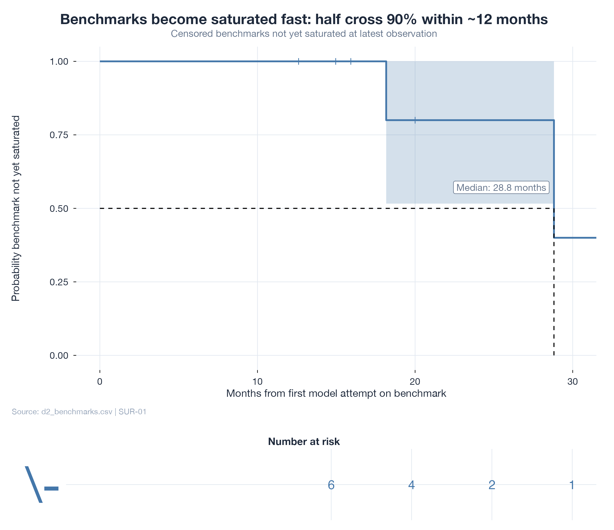
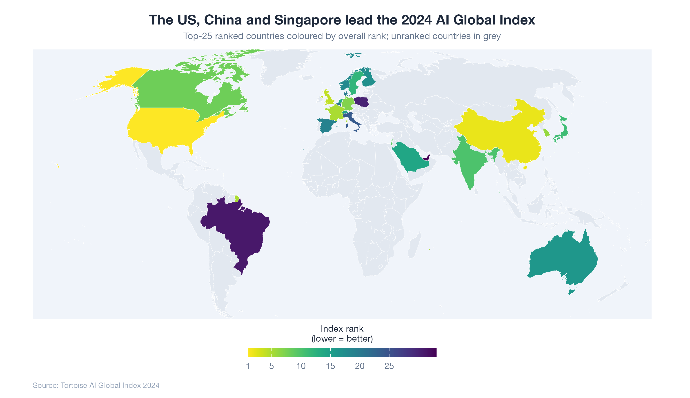
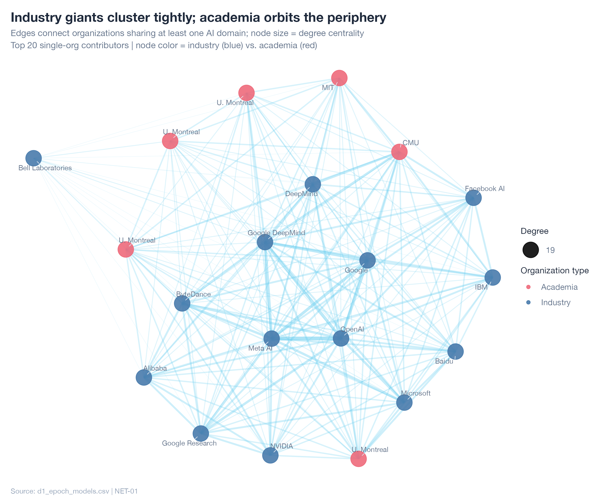
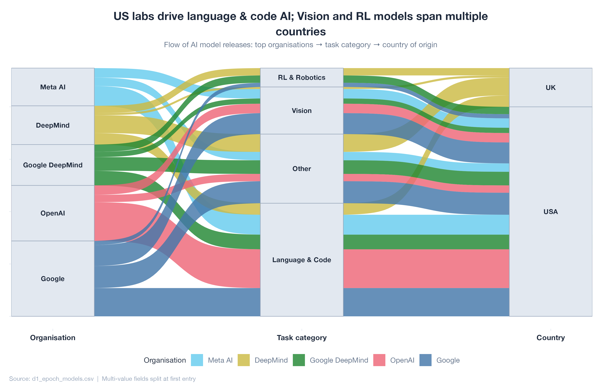

# R High-Fidelity Visualization Skill

[](LICENSE)
[](skill.json)
[](https://github.com/Alex-Zeo/R/actions/workflows/validate.yml)

**You shouldn't need a PhD in ggplot2 to make a chart that belongs in a journal.** This skill gives any AI agent the deep R visualization knowledge that normally takes years to build: the right geom for every analytical goal, colorblind-safe palettes by default, publication-grade export settings, and 108 quality checks that catch the mistakes reviewers will. Describe your data and what you want to show. Get back a complete, styled, reproducible R script ready for your next paper, deck, or dashboard.

---

## Gallery

Every chart below was generated entirely by AI using this skill. No manual editing.

### Comparison



*Grouped bar chart: LLM benchmark scores across MMLU, GPQA Diamond, and MATH-500*

### Correlation

| Slate | Aurora |
|:---:|:---:|
|  |  |

*Scatter + OLS regression: intelligence index vs. API price (log scale). Same data, two brand templates.*

### Distribution



*Raincloud plot: pricing distribution across cost tiers with jittered points and half-violin density*

### Statistical

| Slate | Journal |
|:---:|:---:|
|  |  |

*Forest plot: mean ECI capability scores with confidence intervals, ordered by effect size*

### Survival



*Kaplan-Meier curve with number-at-risk table: benchmark saturation analysis*

### Geospatial



*Choropleth map: 2024 AI Global Index rankings with viridis colour scale*

### Network



*Force-directed network: AI organisation collaboration clusters, node size = degree centrality*

### Composition



*Alluvial diagram: flow of AI model releases from organisation to task category to country*

---

## Quick Start

### In Claude Code

```bash
# Load the skill for an R visualization session
claude --skill ./plan.md "Plot highway MPG vs engine displacement colored by vehicle class"
```

### In Claude Web (claude.ai)

Go to **Settings > Integrations > Add MCP Server**, set the name to **R Visualization Skill**, and paste this URL:

```
https://web-production-51070.up.railway.app/mcp/
```

Leave all other fields blank. OAuth is handled automatically. Once connected, just ask Claude to create any R visualization and the skill activates.

### As MCP Context

Point your MCP host at `skill.json` in this repository. The host will automatically
activate the skill when the user's prompt matches any trigger phrase (see below).

### Manual use

Copy the contents of `plan.md` into your system prompt or context window before asking
for an R visualization.

---

## Brand Template System

No more debating hex codes. All charts support 4 built-in brand templates that control fonts, colours, backgrounds, and spacing. Every palette is colorblind-safe, so your work is accessible from day one:

| Template | Font | Palette | Background | Best for |
|---|---|---|---|---|
| **Slate** | Helvetica Neue | Paul Tol Bright | White | General purpose, clean |
| **Aurora** | Avenir Next | Paul Tol Vibrant | White | Presentations, bold accents |
| **Earth** | Georgia | Paul Tol Muted | Warm cream | Reports, warm tone |
| **Journal** | Palatino | Tableau-10 | White | Print publications, tight margins |

Scripts access tokens via `brand$token_name` after sourcing the shared theme engine. Every visual property (point sizes, line widths, alpha values, margins, colours) comes from brand tokens rather than hardcoded values.

---

## 9 Chart Families, 36 Battle-Tested Scripts

| Family | Charts | Best for |
|---|---|---|
| **Comparison** | Grouped bar, lollipop, violin + jitter, dumbbell | Ranking items, A/B results, benchmark scores |
| **Composition** | Stacked bar, treemap, waffle, alluvial | Part-to-whole breakdowns, budget flows, category shares |
| **Correlation** | Scatter + trend, labeled scatter, matrix, bubble | Relationship discovery, regression, feature co-occurrence |
| **Distribution** | Histogram + density, ridgeline, raincloud, ECDF | Spread and shape of continuous variables, group comparisons |
| **Geospatial** | Choropleth, bubble map, hex tile, faceted choropleth | Regional patterns, country rankings, spatial density |
| **Network** | Force-directed, tree, circular | Collaboration graphs, org hierarchies, citation clusters |
| **Statistical** | Forest plot, PCA biplot, regression diagnostics, QQ | Meta-analyses, model diagnostics, effect-size summaries |
| **Survival** | Kaplan-Meier, KM + risk table | Time-to-event analysis, clinical trials, churn modeling |
| **Time Series** | Multi-line, stacked area, line + ribbon, dual facet | Trends over time, forecasts, seasonality, period comparisons |

---

## Trigger Keywords

This skill activates on prompts containing any of:

`R chart` · `ggplot` · `visualization` · `R plot` · `data viz` · `scatter plot` ·
`bar chart` · `boxplot` · `heatmap` · `forest plot` · `survival curve` ·
`time series` · `histogram` · `violin` · `raincloud` · `ggplot2`

---

## What You Get Back

You describe your data and your analytical goal. The skill returns a **complete,
self-contained R script** that:

- Loads only the required libraries from the vetted package stack
- Prepares data using tidy patterns
- Builds a polished ggplot2 visualization with insight-driven titles
- Applies a colorblind-safe palette by default
- Uses brand tokens for all visual properties
- Exports at publication-grade resolution with `ggsave()`

Every generated script passes a 26-point quality checklist before delivery.

---

## Capability Overview

| Skill section | What it covers |
|---|---|
| [Plot Selection Guide](plan.md#3--plot-selection-guide) | Match your analytical goal to the right geom |
| [Color System](plan.md#4--color-system) | Colorblind-safe palettes, `scale_*` reference |
| [Theme & Typography](plan.md#5--theme--typography-system) | `theme_pub()`, pre-built themes, rich text |
| [Annotations](plan.md#6--annotation-best-practices) | Labels, reference lines, stat annotations |
| [Multi-Panel](plan.md#8--multi-panel-composition-patchwork) | `patchwork` layouts, legend collection |
| [Export](plan.md#9--export-settings) | Journal presets for Nature, Science, PLOS, JAMA |
| [Data Ingestion](plan.md#14--data-ingestion-patterns) | CSV, Excel, database, API, tidy reshape |
| [Tables](plan.md#15--publication-tables) | `gt`, `flextable`, `gtsummary` |
| [Advanced Charts](plan.md#16--advanced-chart-types) | Survival, network, map, alluvial, waffle |
| [Troubleshooting](plan.md#12--edge-cases--troubleshooting) | 18 common failure modes with fixes |

---

## Quality Validation

Every script is held to the same standard a journal reviewer would enforce. Two validation systems make sure nothing slips through:

**Automated checklist** (`tests/checklist_auto.R`): 12 base rules plus family-specific checks:
- Library calls present, `ggsave()` with explicit dimensions and DPI
- Colorblind-safe palette (Okabe-Ito, viridis, or brand tokens)
- No `setwd()`, no `install.packages()`, no hardcoded paths
- COR-family: trend lines, R-squared annotations, overplotting handling, coord_fixed for heatmaps
- Chart family auto-detection from filename for targeted validation

**26-point quality checklist** ([Section 11](plan.md#11--quality-checklist)):
- Insight-driven title + units in axis labels
- Greyscale legibility pass
- No chartjunk, no 3D effects
- Fully self-contained and reproducible

---

## Package Prerequisites

Install the full stack before running any generated script:

```r
install.packages(c(
  # Core
  "tidyverse", "scales",
  # Layout & labels
  "patchwork", "ggrepel", "ggtext",
  # Color
  "viridis", "RColorBrewer", "ggsci", "colorspace",
  # Themes
  "hrbrthemes", "ggpubr", "ggthemes",
  # Statistical viz
  "ggstatsplot", "ggcorrplot", "survminer", "broom", "ggeffects",
  # Extensions
  "ggridges", "ggbeeswarm", "ggrain", "gghighlight", "ggforce",
  "gganimate", "ggdist", "treemapify", "waffle", "ggalluvial",
  "ggraph", "tidygraph",
  # Data
  "palmerpenguins", "gapminder", "readxl", "DBI", "httr2", "jsonlite",
  "lubridate", "sf", "rnaturalearth", "rnaturalearthdata",
  # Tables
  "gt", "flextable", "gtsummary",
  # Export
  "ragg", "svglite", "sessioninfo"
))
```

---

## Standalone Examples

Ready-to-run R scripts are in the [`examples/`](examples/) directory:

| File | Chart type | Dataset |
|---|---|---|
| `01_scatter_regression.R` | Scatter + regression | `ggplot2::mpg` |
| `02_raincloud_distributions.R` | Raincloud + stats | `palmerpenguins` |
| `03_timeseries_highlight.R` | Time series + highlight | `gapminder` |
| `04_forest_plot.R` | Forest plot | `datasets::mtcars` |
| `05_multipanel_composite.R` | Multi-panel (patchwork) | `palmerpenguins` |
| `06_correlation_heatmap.R` | Correlation heatmap | `palmerpenguins` |

---

## Development

See [CONTRIBUTING.md](CONTRIBUTING.md) for how to add new chart types, fix R syntax,
or expand the troubleshooting section.

All changes should target `plan.md`. There is no build step, test runner, or
compilation. Run `tests/checklist_auto.R` against any new code example before submitting.

---

## Limitations

- Does not generate interactive widgets (`plotly`, Shiny)
- Does not execute R code. It produces complete scripts for the user to run
- Does not access user data directly. It works with described data or built-in datasets

See [Section 13](plan.md#13--what-this-skill-cannot-do) for the full list.

---

## License

[MIT](LICENSE) © 2026 Alex-Zeo
